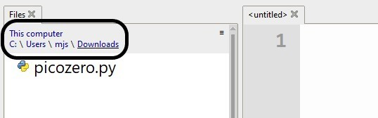

## تثبيت picozero من غير الاتصال بالأنترنت

إذا لم يكن لديك وصول إلى الإنترنت على الحاسوب الذي تتصل به Raspberry Pi Pico ، أو لم يكن لديك أذونات لتثبيت الحزم مع Thonny، فلا يزال بإمكانك استخدام مكتبة picozero.

بإمكانك استخدام حاسوبا اخر متصل بالأنترنت لتحميل الملف الذي تحتاجه و ثم خزن الملف في ذاكرة USB.

1. انتقل إلى ملف `picozero.py` في مستودع GitHub [picozero](https://raw.githubusercontent.com/RaspberryPiFoundation/picozero/master/picozero/picozero.py?token=GHSAT0AAAAAABRLTKWZCT53CGKBFHMJGE54YSC762A) باستخدام مستعرض ويب.

2. انقر بزر الفأرة الأيمن على صفحة picozero ، واختر **Save page as**.

3. اختر موقع التنزيل ، وأترك إسم الملف كما هو - `picozero.py`

### الخيار 1 - نقل الملفات باستخدام مدير ملفات Thonny

1. على الحاسوب قم بتوصيل Raspberry Pi Pico الخاصة بك بأستخدام كابل microUSB.

2. قم بتحميل Thonny من قائمة التطبيق الخاصة بك ، ثم من القائمة **View** ، اختر رؤية الملفات.

    

3. استخدم المسار للانتقال إلى المجلد حيث قمت بحفظ ملف `picozero.py`.

    

4. انقر بزر الفأرة الأيمن على `picozero.py` وحدد **Upload to /** من خلال القائمة.

    

5. يجب أن ترى الآن نسخة جديدة من مكتبة `picozero.py` على Raspberry Pi Pico.

### الخيار 2 - نسخ الملف ولصقه باستخدام Thonny

1. حدد كل النص في ملف `picozero.py` بالضغط على **Ctrl + a** على لوحة المفاتيح ، ثم انسخه بالضغط على **Ctrl + c**.

2. افتح Thonny ، وانقر فوق علامة التبويب **untitled** واضغط **Ctrl + v** للصق محتويات `picozero.py` في الملف.

3. استخدم **Ctrl + s** لحفظ الملف ، وعندما يُطلب منك احفظه في **Raspberry Pi Pico**

    

4. قم بتسمية الملف `picozero.py` ثم انقر فوق الزر **OK**.

    

