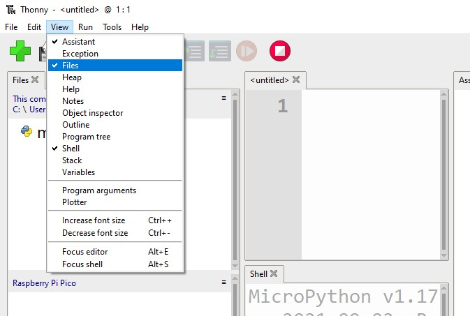
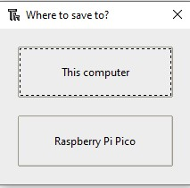

## Instalace picozero offline

Pokud nemáš přístup k internetu na počítači, s nímž se připojuješ k Raspberry Pi Pico, nebo nemáš oprávnění k instalaci balíčků pomocí Thonny, můžeš stále používat knihovnu picozero.

Potřebný soubor si můžeš stáhnout z jiného počítače připojeného k internetu a poté jej uložit na USB flash disk.

1. V repozitáři [picozero na GitHubu](https://raw.githubusercontent.com/RaspberryPiFoundation/picozero/master/picozero/picozero.py?token=GHSAT0AAAAAABRLTKWZCT53CGKBFHMJGE54YSC762A) přejdi pomocí webového prohlížeče k souboru `picozero.py`.

2. Klikni pravým tlačítkem myši na stránku picozero a zvol **Uložit stránku jako**.

3. Vyber umístění pro stahování a ponech název souboru stejný - `picozero.py`

### Možnost 1 – Přenos souborů pomocí správce souborů Thonny

1. K počítači připoj Raspberry Pi Pico pomocí microUSB kabelu.

2. Spusť Thonny z nabídky aplikace a poté v nabídce **Zobrazit** vyber zobrazení souborů.

    

3. Pomocí cesty přejdi do adresáře, kde je uložen soubor `picozero.py`.

    

4. Klikni pravým tlačítkem myši na `picozero.py` a z nabídky vyber **Nahrát do /**.

    

5. Nyní bys měl vidět novou kopii knihovny `picozero.py` na Raspberry Pi Pico.

### Možnost 2 - Zkopíruj a vlož soubor pomocí Thonny

1. Vyber veškerý text v souboru `picozero.py` stisknutím kláves **Ctrl + a** na klávesnici a poté jej zkopíruj stisknutím kláves **Ctrl + c**.

2. Otevři Thonny, klikni na záložku **bez názvu** a stiskni **Ctrl + v** pro vložení obsahu souboru `picozero.py` do souboru.

3. Použij **Ctrl + s** pro uložení souboru a po zobrazení výzvy zvol uložení do **Raspberry Pi Pico**

    

4. Pojmenuj soubor `picozero.py` a poté klikni na tlačítko **OK**.

    

