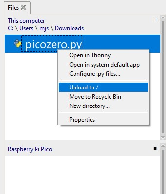
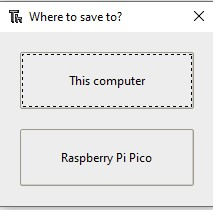
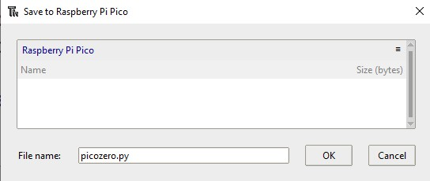

## Εγκατάσταση της βιβλιοθήκης picozero χωρίς σύνδεση στο internet

Αν στον Υπολογιστή που έχεις συνδέσει το Raspberry Pi Pico δεν έχεις internet ή δεν έχεις δικαίωμα να εγκαταστήσεις βιβλιοθήκες μέσω του Thonny, υπάρχει ακόμα τρόπος να χρησιμοποιήσεις τη βιβλιοθήκη picozero.

Μπορείς να κατεβάσεις το αρχείο από έναν άλλο Υπολογιστή, που έχει internet, και στη συνέχεια να το αποθηκεύσεις σε ένα USB stick.

1. Βρες το αρχείο `picozero.py` στο αποθετήριο της βιβλιοθήκης [picozero στο Github](https://raw.githubusercontent.com/RaspberryPiFoundation/picozero/master/picozero/picozero.py?token=GHSAT0AAAAAABRLTKWZCT53CGKBFHMJGE54YSC762A) μέσω ενός broswer.

2. Κάνε δεξί κλικ στη σελίδα και διάλεξε **Αποθήκευση σελίδας ως (Save page as)**.

3. Διάλεξε ένα φάκελο αποθήκευσης και αποθήκευσε το αρχείο ως `picozero.py`

### Μεταφορά αρχείων μέσω του διαχειριστή αρχείων του Thonny

1. Σύνδεσε το Raspberry Pi Pico στον Υπολογιστή σου με ένα καλώδιο microUSB.

2. Άνοιξε το Thonny και στη συνέχεια από το menu **View** διάλεξε files.

    

3. Use the path to navigate to the directory where you saved the `picozero.py` file.

    

4. Right click on the `picozero.py` and select **Upload to /** from the menu.

    

5. Θα πρέπει πλέον να φαίνεται ένα νέο αρχείο της βιβλιοθήκης `picozero.py` στο Raspberry Pi Pico.

### Αντιγραφή και Επικόλληση του αρχείου μέσω του Thonny

1. Επιλέξτε όλο το περιεχόμενο της σελίδας `picozero.py`, πατώντας **Ctrl + a** από το πληκτρολόγιο, και στη συνέχεια πατήστε **Ctrl + c**.

2. Αφού ανοίξεις το Thonny, κάνε κλικ στην καρτέλα **untitled** και πάτα **Ctrl + v** για να κάνεις επικόλληση το περιεχόμενο του `picozero.py` στο νέο αρχείο.

3. Πάτα **Ctrl + s** για να σώσεις το αρχείο, και όταν εμφανιστεί το κατάλληλο παράθυρο διάλεξε αποθήκευσή στο **Raspberry Pi Pico**

    

4. Άλλαξε το όνομα του αρχείου σε `picozero.py` και στη συνέχεια κάνε κλικ στο κουμπί **OK**.

    

