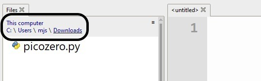
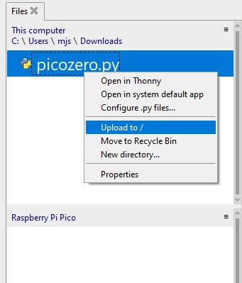
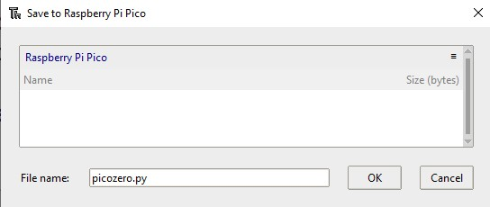

## Εγκατάσταση του picozero χωρίς σύνδεση στο internet

Εάν δεν έχεις πρόσβαση στο διαδίκτυο στον υπολογιστή που έχεις συνδέσει το Raspberry Pi Pico ή δεν έχεις δικαιώματα εγκατάστασης πακέτων με το Thonny, μπορείς να χρησιμοποιήσεις τη βιβλιοθήκη picozero.

Μπορείς να κατεβάσεις το αρχείο από έναν άλλο υπολογιστή που έχει σύνδεση στο internet και στη συνέχεια να το αποθηκεύσεις σε ένα USB stick.

1. Πήγαινε στο αρχείο `picozero.py` στο [αποθετήριο picozero στο Github](https://raw.githubusercontent.com/RaspberryPiFoundation/picozero/master/picozero/picozero.py?token=GHSAT0AAAAAABRLTKWZCT53CGKBFHMJGE54YSC762A) μέσω ενός web browser.

2. Κάνε δεξί κλικ στη σελίδα picozero και επίλεξε **Αποθήκευση σελίδας ως**.

3. Διάλεξε ένα φάκελο λήψης και αποθήκευσε το αρχείο ως `picozero.py`

### Επιλογή 1 - Μεταφορά αρχείων μέσω του διαχειριστή αρχείων του Thonny

1. Σύνδεσε το Raspberry Pi Pico στον υπολογιστή σου με ένα καλώδιο microUSB.

2. Άνοιξε το Thonny και στη συνέχεια από το menu **View** διάλεξε files.

    

3. Βρες τον φάκελο που αποθήκευσες πριν το αρχείο `picozero.py`.

    

4. Κάνε δεξί κλικ στο `picozero.py` και στη συνέχεια πάτα **Upload to/** από το μενού.

    

5. Θα πρέπει πλέον να φαίνεται ένα νέο αντίγραφο της βιβλιοθήκης `picozero.py` στο Raspberry Pi Pico.

### Επιλογή 2 - Αντιγραφή και Επικόλληση του αρχείου μέσω του Thonny

1. Επίλεξε όλο το κείμενο του αρχείου `picozero.py`, πατώντας **Ctrl + a** από το πληκτρολόγιο, και στη συνέχεια πάτα **Ctrl + c**.

2. Αφού ανοίξεις το Thonny, κάνε κλικ στην καρτέλα **untitled** και πάτα **Ctrl + v** για να κάνεις επικόλληση το περιεχόμενο του `picozero.py` στο νέο αρχείο.

3. Πάτα **Ctrl + s** για να αποθηκεύσεις το αρχείο, και όταν ερωτηθείς, διάλεξε αποθήκευση στο **Raspberry Pi Pico**

    

4. Άλλαξε το όνομα του αρχείου σε `picozero.py` και στη συνέχεια κάνε κλικ στο κουμπί **OK**.

    

