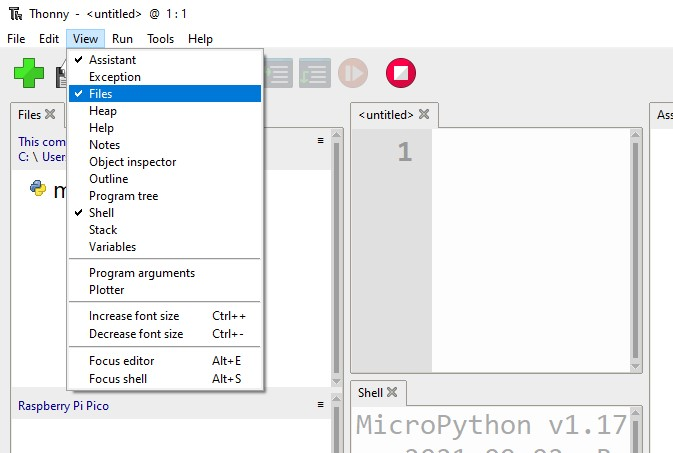

## Installation de picozero hors ligne

Si tu n'as pas accès à Internet sur l'ordinateur que tu connectes à ton Raspberry Pi Pico, ou si tu n'as pas les autorisations nécessaires pour installer des paquets avec Thonny, tu peux toujours utiliser la bibliothèque picozero.

Tu peux utiliser un autre ordinateur connecté à internet pour télécharger le fichier dont tu as besoin, puis le sauvegarder sur une clé USB.

1. Accède au fichier `picozero.py` dans le [dépôt GitHub de picozero](https://raw.githubusercontent.com/RaspberryPiFoundation/picozero/master/picozero/picozero.py?token=GHSAT0AAAAAABRLTKWZCT53CGKBFHMJGE54YSC762A) en utilisant un navigateur web.

2. Fais un clic droit sur la page picozero, et choisis **Enregistrer la page sous**.

3. Choisis un emplacement pour le téléchargement, et garde le même nom de fichier - `picozero.py`

### Option 1 - Transférer les fichiers en utilisant le gestionnaire de fichiers Thonny

1. Sur l'ordinateur, connecte ton Raspberry Pi Pico au moyen d'un câble micro USB.

2. Ouvre Thonny depuis le menu d'application, puis dans le menu **Affichage**, choisis d'afficher les fichiers.

    

3. Use the path to navigate to the directory where you saved the `picozero.py` file.

    

4. Right click on the `picozero.py` and select **Upload to /** from the menu.

    

5. Tu dois à présent voir une nouvelle copie de la bibliothèque `picozero.py` sur le Raspberry Pi Pico.

### Option 2 - Copier et coller le fichier à l'aide de Thonny

1. Sélectionne tout le texte du fichier `picozero.py` en appuyant sur **Ctrl + a** sur ton clavier, puis copie-le en appuyant sur **Ctrl + c**.

2. Ouvre Thonny, clique sur l'onglet **untitled** et appuie sur **Ctrl + v** pour coller le contenu de `picozero.py` dans le fichier.

3. Utilise **Ctrl + s** pour enregistrer le fichier, et lorsque tu y es invité, choisis de l'enregistrer sur **Raspberry Pi Pico**

    

4. Nomme le fichier `picozero.py` puis clique sur le bouton **OK**.

    

