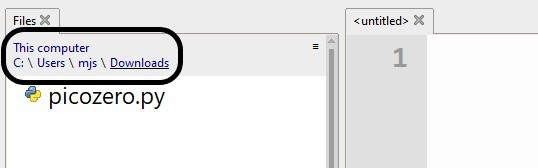

## Picozero offline installeren

Als je geen toegang hebt tot het internet op de computer die je met je Raspberry Pi Pico verbindt, of als je geen rechten hebt om pakketten met Thonny te installeren, kun je nog steeds de picozero-bibliotheek gebruiken.

Je kunt een andere computer met internetverbinding gebruiken om het bestand dat je nodig hebt te downloaden en het bestand vervolgens op een USB-stick op te slaan.

1. Ga met een webbrowser naar het bestand `picozero.py` in de [picozero GitHub-repository](https://raw.githubusercontent.com/RaspberryPiFoundation/picozero/master/picozero/picozero.py?token=GHSAT0AAAAAABRLTKWZCT53CGKBFHMJGE54YSC762A).

2. Klik met de rechtermuisknop op de picozero-pagina en kies **Opslaan als**.

3. Kies een downloadlocatie en houd de bestandsnaam hetzelfde - `picozero.py`

### Optie 1 - bestanden overbrengen met Thonny File Manager

1. Sluit de Raspberry Pi Pico op de computer aan met behulp van een micro-USB-kabel.

2. Laad Thonny vanuit het toepassingenmenu en kies vervolgens uit het **View** menu om bestanden te bekijken.

3. Gebruik het pad om te navigeren naar de map waar je het `picozero.py` bestand hebt opgeslagen.

4. Klik met de rechtermuisknop op de `picozero.py` en selecteer **Upload to /** in het menu.

5. Je zou nu een nieuwe versie van de `picozero.py` bibliotheek moeten zien op de Raspberry Pi Pico.

### Optie 2 - Kopieer en plak het bestand met Thonny

1. Selecteer alle tekst in het bestand `picozero.py` door op **Ctrl + a** op het toetsenbord te drukken en kopieer deze vervolgens door op **Ctrl + c** te drukken.

2. Open Thonny, klik op het **untitled** tabblad en druk op **Ctrl + v** om de inhoud van `picozero.py` in het bestand te plakken.

3. Gebruik **Ctrl + s** om het bestand op te slaan en kies wanneer daarom wordt gevraagd om het op te slaan op **Raspberry Pi Pico**

4. Geef het bestand de naam `picozero.py` en klik vervolgens op de knop **OK**.

