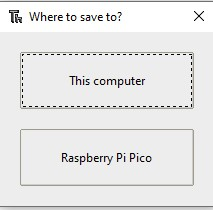

## Installerar picozero offline

Om du inte har tillgång till internet på datorn du ansluter till din Raspberry Pi Pico, eller om du inte har behörighet att installera paket med Thonny, kan du fortfarande använda picozero-biblioteket.

Du kan använda en annan internetansluten dator för att ladda ner filen du behöver och sedan lagra filen på ett USB-minne.

1. Gå till filen `picozero.py` i [picozero GitHub-biblioteket](https://raw.githubusercontent.com/RaspberryPiFoundation/picozero/master/picozero/picozero.py?token=GHSAT0AAAAAABRLTKWZCT53CGKBFHMJGE54YSC762A) med en webbläsare.

2. Högerklicka på picozero-sidan och välj **Spara sida som**.

3. Välj en nedladdningsplats och behåll filnamnet detsamma - `picozero.py`

### Alternativ 1 - Överför filer med Thonny filhanterare

1. På datorn anslut din Raspberry Pi Pico med en microUSB-kabel.

2. Ladda Thonny från din programmeny, välj sedan från **View** -menyn och välj att se files.

    

3. Använd sökvägen för att navigera till katalogen där du sparade filen `picozero.py`.

    

4. Högerklicka på `picozero.py` och välj **Upload to /** från menyn.

    

5. Du bör nu se en ny kopia av `picozero.py` -biblioteket på Raspberry Pi Pico.

### Alternativ 2 - Kopiera och klistra in filen med Thonny

1. Markera all text i filen `picozero.py` genom att trycka på **Ctrl + a** på ditt tangentbord, kopiera den sedan genom att trycka på **Ctrl + c**.

2. Öppna Thonny, klicka i **untitled**-rutan och tryck **Ctrl + v** för att klistra in innehållet `picozero.py` till filen.

3. Använd **Ctrl + s** för att spara filen och välj **Raspberry Pi Pico** när du uppmanas att spara

    

4. Namnge filen `picozero.py` och klicka sedan på knappen **OK**.

    

